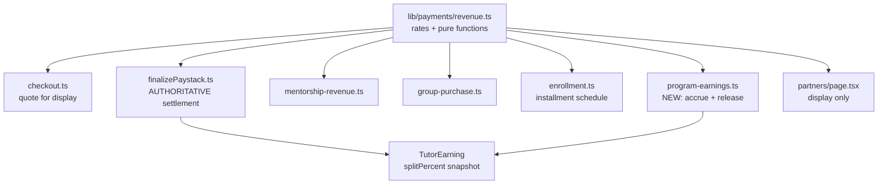

# Revenue Sharing: Single Source of Truth & Program Splits

> [!IMPORTANT]
> **Executive Summary**
> Revenue split rates currently live in more than one place and are applied by duplicated arithmetic, so a rate change can move money at one number while recording another in the ledger. This plan consolidates every sharing formula into one pure module, then extends splitting to Professional Programs — which today have no tutor attribution and bypass the payments layer entirely.
>
> **Status:** Phase 0 complete. Phases 1–3 not started.
> **Owner:** fusco · **Drafted:** 2026-08-09

---

## 1. Decisions Log

Settled before drafting. Change these here first if they change at all.

| # | Decision | Resolution | Rationale |
| :- | :- | :- | :- |
| D1 | Course split rates | Normal **25/75**, referral **50/50**, platform promo **25/75**, instructor promo **50/50** | Business decision, 2026-08-09 |
| D2 | Rates static or DB-configurable | **Static constants in code** | Split changes are commercial decisions deserving review + git audit trail; DB config would make every split function `async` and add a failure mode inside the payment settlement path |
| D3 | Program split basis | **25% of `fullPrice`**, not `installTotal` | The installment surcharge is a financing fee compensating platform credit risk, not tutor delivery |
| D4 | Program attribution | **Single lead instructor, per cohort** | A program runs many cycles with different staff; cohort is the correct grain |
| D5 | Program accrual timing | **Per installment, as cash lands** | Accruing full share on 70% collected books an obligation against uncollected money |
| D6 | Program release gate | `max(paidAt + 30d, cohort.startDate)` | 30d matches the published money-back guarantee; cohort start protects against cohorts cancelled for low enrolment |
| D7 | Earnings ledger shape | **Extend `TutorEarning`**, not a parallel table | One ledger keeps wallet, withdrawal and reporting queries single-sourced. Cost: three FKs become nullable |

---

## 2. Current State

### 2.1 What exists

| Formula | Location | Form |
| :- | :- | :- |
| Course split | `lib/payments/pricing.ts` → `SPLIT_RATES` | Named constants + `getSplitPercent()` |
| VAT 7.5% | `lib/payments/pricing.ts` → `DEFAULT_VAT_RATE` | Named constant |
| Promo discount | `lib/payments/pricing.ts` | Inline in `computeCheckoutTotals` |
| Mentorship 70/30 | `actions/mentorship-revenue.ts` ×3, `lib/payments/finalizePaystack.ts` ×2 | **Bare literals, no constant** |
| Mentorship packages | `actions/mentorship-revenue.ts:12` | Local `packageConfig` |
| Program installments | `actions/enrollment.ts:167,189` | Bare literals `0.5`, `programDef.firstInstall` |
| Group cashback | `actions/group-purchase.ts:83` | Rate per-row on `GroupTier.cashbackPercent` |
| Program tutor split | — | **Does not exist** |

### 2.2 Known defects this plan addresses

- **Duplicated selection logic.** `finalizePaystack` re-implemented the promo/referral ternary that `getSplitPercent` already owns. Fixed in Phase 0, but the structural duplication remains until Phase 1.
- **Mentorship rate has no single home.** Five sites, all literals.
- **Marketing contradicts code.** [`app/(root)/partners/page.tsx`](../../app/(root)/partners/page.tsx) advertises "Up to 30% commission" and "70% revenue share"; neither matches any implemented course rate.
- **Programs are outside the payments layer.** `actions/enrollment.ts` writes `ProgramEnrollment` + `InstallmentPayment` and calls Paystack directly — no `Transaction`, no line items, no VAT, no `TutorEarning`.

### 2.3 Pre-existing issues NOT in scope

Logged so they aren't lost. Each deserves its own change.

- **Money stored as `Float`.** Every currency column maps to Postgres `double precision`. `walletBalance` is mutated by `increment:` on every sale, so error compounds and exact-equality comparisons (full-balance withdrawal) can fail. Correct fix is integer minor units (kobo). Large migration against live financial data.
- **Group cashback can drive a tutor negative.** `cashbackTotal` is decremented from the tutor's wallet on group completion with no balance guard.
- **No test runner in the repo.** No `test` script, no vitest/jest config, no test directory. Phase 1 introduces one.
- **Programs charge no VAT** while courses charge 7.5%. A tax-position question, not a splitting question.

---

## 3. Target Architecture

One pure module owns every rate **and** the functions that apply them. Call sites never see a raw rate.



Three invariants the design depends on:

1. **Purity.** No `db` import, no `"use server"`. Client components can import it for display without dragging the server bundle in, and it stays trivially testable.
2. **Settlement is authoritative.** Checkout produces a *quote*; `finalizePaystack` recomputes and is the number that moves money. Already true — Phase 1 makes it explicit.
3. **Applied rates are snapshots.** `TutorEarning.splitPercent` and `Transaction.tutorShareAmount` record what was applied. Changing a constant never retroactively alters recorded earnings.

---

## 4. Phase 0 — Course rate change to 25/75 ✅ COMPLETE

| Scenario | Tutor | Platform |
| :- | :- | :- |
| normal | 25% | 75% |
| tutorReferral | 50% | 50% |
| platformPromo | 25% | 75% |
| instructorPromo | 50% | 50% |

- [x] `SPLIT_RATES.normal` and `.platformPromo` → `0.25` in [`lib/payments/pricing.ts`](../../lib/payments/pricing.ts)
- [x] Replace duplicated literals in [`lib/payments/finalizePaystack.ts:319`](../../lib/payments/finalizePaystack.ts) with `SPLIT_RATES` references — without this, money moves at 25% while `splitPercent` records `0.2`
- [x] `tsc --noEmit` clean
- [ ] Verify on staging that a completed course purchase writes `splitPercent = 0.25`

Historical `TutorEarning` rows retain `0.2`. Correct — those are facts.

---

## 5. Phase 1 — Revenue module + tests

**Goal:** one importable source of truth. No behaviour change.

### 5.1 Create `lib/payments/revenue.ts`

```ts
export const REVENUE = {
  vatRate: 0.075,
  courseSplit:  { normal: 0.25, tutorReferral: 0.5, platformPromo: 0.25, instructorPromo: 0.5 },
  mentorshipSplit: { tutor: 0.7, platform: 0.3 },
  mentorshipPackages: {
    STARTER_3: { sessions: 3, discountPercent: 10, label: "Starter Pack (3)" },
    GROWTH_5:  { sessions: 5, discountPercent: 18, label: "Growth Pack (5)" },
  },
  programSplit: { leadInstructor: 0.25 },
  programInstallment: { defaultFirstPercent: 0.7, minFirstPercent: 0.5 },
  referral: { cookieDays: 30 },
  refundWindowDays: 30,
} as const;

export function computeCheckoutTotals(...)        // moved verbatim from pricing.ts
export function getSplitPercent(...)              // exported, no longer module-private
export function computeMentorshipPrice(...)       // hourlyRate, duration, package
export function computeMentorshipSplit(amount)    // replaces five ×0.7 literals
export function computeInstallmentSchedule(...)   // replaces enrollment.ts arithmetic
export function computeGroupCashback(...)         // rate still per-tier from DB
export function computeProgramTutorShare(...)     // NEW — Phase 3
export function allocateShareAcrossInstallments(...)  // NEW — Phase 3
```

- [ ] Create module; move `computeCheckoutTotals`, `getSplitPercent`, `promoAppliesToCourse`, `roundCurrency`
- [ ] `lib/payments/pricing.ts` becomes a re-export shim so existing imports keep working
- [ ] Compute internally in integers (kobo), return naira — forward-compatible with the eventual `Float` migration

### 5.2 Add test infrastructure

Revenue splitting is the case that justifies the repo's first tests: pure functions, small input space, bugs cost real money.

- [ ] Add `vitest` + `test` script to `package.json`
- [ ] `lib/payments/__tests__/revenue.test.ts` — table-driven over the split matrix:
  - 4 course scenarios × {percentage, fixed} discount × {single, multi-course}
  - VAT allocation including the **rounding-remainder-to-last-item** rule (easy to "clean up" and silently break)
  - Referral only applies when `referralTutorId === course.tutorId`
  - `INSTRUCTOR` promo applies only when `creatorId === course.tutorId`
  - Mentorship package pricing and 70/30
  - Installment schedule incl. custom first payment at the 50% floor

> [!NOTE]
> Write these tests **before** the Phase 2 refactor so they pin current behaviour and catch any accidental shift.

**Exit criteria:** tests green, `tsc --noEmit` clean, no behaviour change.

---

## 6. Phase 2 — Collapse the duplicates

Mechanical. Each item removes a literal and points it at `REVENUE`.

- [ ] `actions/mentorship-revenue.ts:164` — instant booking → `computeMentorshipSplit()`
- [ ] `actions/mentorship-revenue.ts:654` — approved REQUEST booking → same
- [ ] `actions/mentorship-revenue.ts:1030` — offering booking → same
- [ ] `actions/mentorship-revenue.ts:12` — `packageConfig` → `REVENUE.mentorshipPackages`
- [ ] `lib/payments/finalizePaystack.ts:118,140` — `0.7` fallbacks → `REVENUE.mentorshipSplit.tutor`
- [ ] `actions/enrollment.ts:167,189` — installment percentages → `computeInstallmentSchedule()`
- [ ] `actions/group-purchase.ts:83` — → `computeGroupCashback()` (rate still per-tier from DB)
- [ ] `app/(root)/partners/page.tsx:17,33` — render from `REVENUE` so marketing can't drift from code
- [ ] Grep sweep for surviving `0.7` / `0.3` / `0.25` / `0.075` in payment paths

**Exit criteria:** no bare split literal outside `revenue.ts`; tests green.

---

## 7. Phase 3 — Program revenue share

### 7.1 Formula

```
programTutorShare = fullPrice × 0.25
share_i = programTutorShare × (installment_i.amount / enrollment.totalAmount)
```
Last installment absorbs the rounding remainder, matching the VAT allocator.

Worked example — ₦300,000 program (`installTotal` ₦320,000, first ₦224,000):

| Plan | Installment | Collected | Tutor accrues |
| :- | :- | :- | :- |
| Installment | 1 of 2 | ₦224,000 | ₦52,500 |
| Installment | 2 of 2 | ₦96,000 | ₦22,500 |
| | **total** | **₦320,000** | **₦75,000** |
| Full payment | single | ₦300,000 | ₦75,000 |

Using `enrollment.totalAmount` as denominator makes one expression serve both plans and survives the custom first payment (any value ≥50% of `installTotal`). Effective platform take: 75% full payment, 76.6% installments — the delta is exactly the financing surcharge, per **D3**.

### 7.2 Schema migration

```prisma
model ProgramCohort {
  leadInstructorId String?   // nullable: cohorts created before staffing
  leadInstructor   User?     @relation("CohortLeadInstructor", fields: [leadInstructorId], references: [id])
}

model TutorEarning {
  source                TutorEarningSource @default(COURSE)
  transactionId         String?            // was NOT NULL
  transactionLineItemId String?            // was NOT NULL
  courseId              String?            // was NOT NULL

  programEnrollmentId  String?
  installmentPaymentId String?  @unique    // idempotency key — load-bearing
  cohortId             String?

  availableAt  DateTime?   // existing field, now the release gate
  releasedAt   DateTime?
  releasedById String?     // audit: which admin released
}

enum TutorEarningSource { COURSE  PROGRAM }
enum TutorEarningStatus { PENDING  AVAILABLE  PAID  CANCELLED }  // + CANCELLED
```

- [ ] Write migration; back-fill `source = COURSE` for all existing rows
- [ ] Audit every existing `TutorEarning` query for the now-nullable `courseId` join

> [!WARNING]
> Relaxing three `NOT NULL` constraints weakens the course-side invariant. Accepted per **D7** — two earnings tables would fork every payout and report query. Any query that joins `course` must handle `null`.

### 7.3 Accrual — idempotent, order-independent

Staffing and payment can happen in either order; a cohort may be staffed after enrolments open. Accrual therefore runs from **both** triggers, writing the same row either way. The `@unique` on `installmentPaymentId` makes the second a no-op rather than a double credit. Do not attempt to guarantee ordering — that yields either missing or duplicated accruals.

- [ ] `actions/program-earnings.ts` → `accrueProgramEarning(installmentPaymentId)`
- [ ] Trigger on installment payment verification (`actions/program-balance-payment.ts` + initial enrolment path)
- [ ] Trigger on lead-instructor assignment — accrue for all already-paid installments
- [ ] Set `availableAt = max(paidAt + 30d, cohort.startDate)`, status `PENDING`
- [ ] **Do not touch `walletBalance`**

### 7.4 Release — admin action, per cohort

- [ ] `releaseProgramEarnings(cohortId)` — super-admin only
- [ ] Flip `PENDING → AVAILABLE` where `availableAt <= now()`; credit `walletBalance`; stamp `releasedAt` / `releasedById`
- [ ] Status check + wallet increment inside **one DB transaction** so a double-click cannot pay twice
- [ ] Amount is never human-entered — computed at accrual, immutable

> [!IMPORTANT]
> **Behavioural difference from courses.** Course earnings credit `walletBalance` immediately on creation. Program earnings do not — `PENDING` is accrued but not spendable. Earnings UI must show the two states distinctly or tutors will read accrued as withdrawable.

### 7.5 Admin & tutor UI

- [ ] Cohort admin: assign / change lead instructor
- [ ] Cohort admin: accrued vs released totals, release action with eligibility reason when blocked
- [ ] Tutor wallet: "Accrued (pending release)" separate from available balance

### 7.6 Refunds

- [ ] Refund **before** release → `CANCELLED`, no wallet impact
- [ ] Refund **after** release → clawback. **Out of scope**; handle with the group-cashback negative-balance fix rather than shipping a second broken version.

**Exit criteria:** enrol → pay both installments → accrue twice → release after gate → wallet credited exactly `0.25 × fullPrice`, verified on staging.

---

## 8. Deferred

| Item | Why deferred |
| :- | :- |
| Kobo migration | Schema migration on live financial data; needs its own plan |
| `Transaction` rows for programs | Touches admin dashboard, VAT ledger, reconciliation. Program revenue stays absent from transaction reports until then |
| VAT on programs | Tax-position decision, not an engineering one |
| Clawbacks / negative wallet guard | Bundle with the group-cashback fix |

---

## 9. Execution Order

1. **Phase 1** — module + tests. Nothing else can safely land first; Phase 3 would otherwise write `0.25` a third time.
2. **Phase 2** — collapse duplicates, guarded by Phase 1 tests.
3. **Phase 3** — programs, in sub-order 7.2 → 7.3 → 7.4 → 7.5.

Phases 1 and 2 are behaviour-preserving and can ship together. Phase 3 changes money movement and wants its own review and staging verification.
